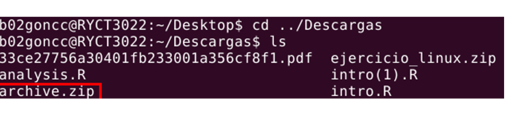
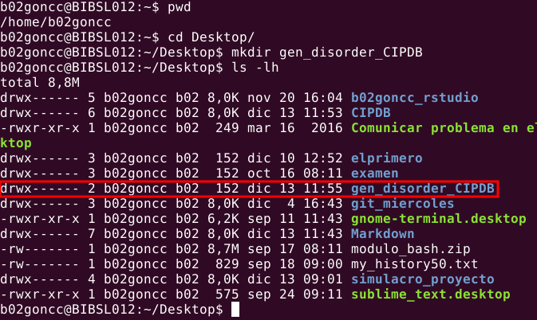

Predicción de enfermedades genéticamente heredables
================
Carlos González Camuñas, Jesús Manuel Muñoz Vázquez
2024-12-16

- [1 Introducción y objetivos](#1-introducción-y-objetivos)
- [2 Materiales y métodos](#2-materiales-y-métodos)
  - [2.1 Trabajo en el terminal](#21-trabajo-en-el-terminal)
    - [2.1.1 Localizamos los archivos](#211-localizamos-los-archivos)
    - [2.1.2 Creación de un nuevo
      directorio](#212-creación-de-un-nuevo-directorio)
    - [2.1.3 Muda de archivos al nuevo
      directorio](#213-muda-de-archivos-al-nuevo-directorio)
    - [2.1.4 Descomprimir archivos](#214-descomprimir-archivos)
    - [2.1.5 Visualización de archivos](#215-visualización-de-archivos)
  - [2.2 Tratamiento de datos en R](#22-tratamiento-de-datos-en-r)
    - [2.2.1 Primera parte](#221-primera-parte)
    - [2.2.2 Segunda parte](#222-segunda-parte)
    - [2.2.3 Tercera parte](#223-tercera-parte)
    - [2.2.4 Cuarta parte](#224-cuarta-parte)
  - [2.3 Elaboración de gráficas con
    ggplot2](#23-elaboración-de-gráficas-con-ggplot2)
    - [2.3.1 Primera hipótesis](#231-primera-hipótesis)
    - [2.3.2 Segunda hipótesis](#232-segunda-hipótesis)
    - [2.3.3 Tercera hipótesis](#233-tercera-hipótesis)
  - [2.4 Elaboración del informe con R
    Markdown](#24-elaboración-del-informe-con-r-markdown)
- [3 Resultados y conclusiones](#3-resultados-y-conclusiones)
  - [3.1 Primera hipótesis](#31-primera-hipótesis)
  - [3.2 Segunda hipótesis](#32-segunda-hipótesis)
  - [3.3 Tercera hipótesis](#33-tercera-hipótesis)
- [4 Bibliografía](#4-bibliografía)

<body background = "images/fotofondo2.png">

<font color="black">

# 1 Introducción y objetivos

La predicción de **enfermedades heredables** de padres a hijos cada vez
ha ido ganando un mayor peso en la  
sociedad actual. Son numerosos los **estudios genómicos** que se hacen
en la actualidad con el fin de, no solo  
conocer mejor nuestro genoma, sino también el conocer las posibles
enfermedades que nuestros hijos  
podrían desarrollar.

A pesar de todo, esto sigue sin ser suficiente para ayudar, ya que la
población, cada vez mayor, también desa-  
rrolla una mayor cantidad de trastornos genéticos.

Nosotros vamos a trabajar con tablas de datos que muestran análisis de
más de 20000 menores con  
trastornos genéticos.

Para ello, vamos a plantear una serie de hipótesis:

- Primera hipótesis:  
  -**H0:** Las enfermedades suelen ser provocadas por un mismo tipo de
  trastorno genético.  
  -**H1:** Las enfermedades no suelen ser provocadas por un mismo tipo
  de trastorno genético.

- Segunda hipótesis:  
  -**H0:** Las madres con mayor edad tienen hijos con mayor número de
  defectos en el nacimiento.  
  -**H1:** Las madres con mayor edad no tienen por qué tener hijos con
  mayor número de defectos en  
  el nacimiento.

- Tercera hipótesis:  
  -**H0:** El número de glóbulos blancos del paciente se ve afectado por
  el desorden genético.  
  -**H1:** El número de glóbulos blancos del paciente no se ve afectado
  por el desorden genético.

# 2 Materiales y métodos

El análisis se ha realizado a partir de las tablas de datos descargadas
desde el repostorio de Amit Kumar  
(*Predict the genetic disorders dataset-of genomes*) en kaggle.  
Primero visualizaremos los archivos usando el terminal, para después
realizar el tratamiento de datos y la  
resolución de nuestras hipótesis mediante **R** ([R Core Team
2024](#ref-R-base)), y lo redactaremos como un informe utilizando  
RMarkdown, para lo que haremos uso de los paquetes:

**dplyr** ([Wickham et al. 2023](#ref-R-dplyr))  
**ggplot2** ([Wickham et al. 2024](#ref-R-ggplot2); [Wickham
2016](#ref-ggplot22016))  
**knitr** ([Xie 2024](#ref-R-knitr), [2014](#ref-knitr2014),
[2015](#ref-knitr2015))  
**kableExtra** ([Zhu 2024](#ref-R-kableExtra))

Por último, subiremos todos los archivos de nuestro proyecto a un
[repostorio
público](https://github.com/cargoncam02/predict_genome_disorders.git) en
GitHub, para libre  
acceso al código y sus contenidos.

## 2.1 Trabajo en el terminal

Para ello, vamos a empezar descargando los archivos desde el repositorio
de Amit Kumar en
[kaggle](https://www.kaggle.com/datasets/aibuzz/predict-the-genetic-disorders-datasetof-genomes/data).

Posteriormente, se extraerán y reubicarán los archivos desde el
terminal, con la siguiente secuencia:

### 2.1.1 Localizamos los archivos

Nos quedamos con el nombre del documento descargado, archive.zip, y la
ruta de la carpeta en la que  
se ha descargado, y la buscamos en el terminal.



### 2.1.2 Creación de un nuevo directorio

Ahora, vamos a crear un nuevo directorio, llamado *gen_disorder_CIPDB*,
en el escritorio, en el que guarda-  
remos todo lo referente a nuestro proyecto:



### 2.1.3 Muda de archivos al nuevo directorio

Ahora movemos el archivo *archive.zip* de la carpeta *Descargas* a la
nueva carpeta de nuestro escritorio:


### 2.1.4 Descomprimir archivos

Como *archive.zip* es un archivo comprimido, lo descomprimimos con el
comando unzip. Una vez descom-  
primidos los archivos, podemos eliminar el zip:


### 2.1.5 Visualización de archivos

Las dos tablas de datos son muy similares, solo que una se utilizó para
entrenar al programa  
en la predicción de enfermedades en función de los síntomas, y la otra
simplemente es  
una recogida de datos reales.


Al visualizar los datos desde el terminal, y ver la dificultad que
supondría seguir con el análisis  
de los datos desde ahí, se decidió utilizar R para realizar el análisis
de datos.

## 2.2 Tratamiento de datos en R

Una vez colocados todos los archivos descargados, se crea un nuevo
proyecto a partir de la carpeta  
*gen_disorder_CIPDB*, y se crea un nuevo archivo RMarkdown. Se van a
tratar los datos a partir de  
bloques de código insertados en el informe.  
Lo primero va a ser cargar los paquetes con los que se va a trabajar:

``` r
#Aquí se podrán instalar los paquetes en caso de no tenerlos (solo habría que
#quitarles el hashtag al principio de la línea):

#install.packages("dplyr")
#install.packages("ggplot2")
#install.packages("kableExtra")

#Ahora, se cargan los paquetes:
library(dplyr)
library(ggplot2)
library(kableExtra)

#Vamos a cargar también el data_frame:
dataset <- read.csv("train_genetic_disorders.csv", row.names = NULL)
```

Ahora, se va a modificar el data_frame para hacerlo más utilizable de
cara al análisis de datos:

``` r
#Aqui vamos a modificar nuestro dataset para poder trabajar con él
mod_data <- dataset %>% 
  select(2:7,11,12,15:17,24:27,29:38,44,45)
```

Por último: se va a representar una tabla con las variables que vamos a
utilizar, pero vamos a  
necesitar hacerlo en varias tablas para poder visualizar todas las
columnas decentemente:

El bloque de código para cada una sería similar a esto:

``` r
knitr::kable(head(mod_data %>% 
                    select(15:21)), align="c", format="html")
```

### 2.2.1 Primera parte

<table>
<thead>
<tr>
<th style="text-align:center;">
Edad (Niño)
</th>
<th style="text-align:center;">
Defecto materno
</th>
<th style="text-align:center;">
Defecto paterno
</th>
<th style="text-align:center;">
Glóbulos rojos (mcL)
</th>
<th style="text-align:center;">
Edad (Madre)
</th>
</tr>
</thead>
<tbody>
<tr>
<td style="text-align:center;">
2
</td>
<td style="text-align:center;">
Yes
</td>
<td style="text-align:center;">
No
</td>
<td style="text-align:center;">
4.760603
</td>
<td style="text-align:center;">
NA
</td>
</tr>
<tr>
<td style="text-align:center;">
4
</td>
<td style="text-align:center;">
No
</td>
<td style="text-align:center;">
No
</td>
<td style="text-align:center;">
4.910669
</td>
<td style="text-align:center;">
NA
</td>
</tr>
<tr>
<td style="text-align:center;">
6
</td>
<td style="text-align:center;">
No
</td>
<td style="text-align:center;">
No
</td>
<td style="text-align:center;">
4.893297
</td>
<td style="text-align:center;">
41
</td>
</tr>
<tr>
<td style="text-align:center;">
12
</td>
<td style="text-align:center;">
Yes
</td>
<td style="text-align:center;">
No
</td>
<td style="text-align:center;">
4.705280
</td>
<td style="text-align:center;">
21
</td>
</tr>
<tr>
<td style="text-align:center;">
11
</td>
<td style="text-align:center;">
</td>
<td style="text-align:center;">
Yes
</td>
<td style="text-align:center;">
4.720703
</td>
<td style="text-align:center;">
32
</td>
</tr>
<tr>
<td style="text-align:center;">
14
</td>
<td style="text-align:center;">
Yes
</td>
<td style="text-align:center;">
No
</td>
<td style="text-align:center;">
5.103188
</td>
<td style="text-align:center;">
NA
</td>
</tr>
</tbody>
</table>

### 2.2.2 Segunda parte

<table>
<thead>
<tr>
<th style="text-align:center;">
Edad (Padre)
</th>
<th style="text-align:center;">
Estado
</th>
<th style="text-align:center;">
Frecuencia Respiratoria
</th>
<th style="text-align:center;">
Pulsaciones por minuto
</th>
<th style="text-align:center;">
Nivel de riesgo
</th>
<th style="text-align:center;">
Género
</th>
</tr>
</thead>
<tbody>
<tr>
<td style="text-align:center;">
NA
</td>
<td style="text-align:center;">
Alive
</td>
<td style="text-align:center;">
Normal (30-60)
</td>
<td style="text-align:center;">
Normal
</td>
<td style="text-align:center;">
High
</td>
<td style="text-align:center;">
</td>
</tr>
<tr>
<td style="text-align:center;">
23
</td>
<td style="text-align:center;">
Deceased
</td>
<td style="text-align:center;">
Tachypnea
</td>
<td style="text-align:center;">
Normal
</td>
<td style="text-align:center;">
High
</td>
<td style="text-align:center;">
</td>
</tr>
<tr>
<td style="text-align:center;">
22
</td>
<td style="text-align:center;">
Alive
</td>
<td style="text-align:center;">
Normal (30-60)
</td>
<td style="text-align:center;">
Tachycardia
</td>
<td style="text-align:center;">
Low
</td>
<td style="text-align:center;">
</td>
</tr>
<tr>
<td style="text-align:center;">
NA
</td>
<td style="text-align:center;">
Deceased
</td>
<td style="text-align:center;">
Tachypnea
</td>
<td style="text-align:center;">
Normal
</td>
<td style="text-align:center;">
High
</td>
<td style="text-align:center;">
Male
</td>
</tr>
<tr>
<td style="text-align:center;">
NA
</td>
<td style="text-align:center;">
Alive
</td>
<td style="text-align:center;">
Tachypnea
</td>
<td style="text-align:center;">
Tachycardia
</td>
<td style="text-align:center;">
Low
</td>
<td style="text-align:center;">
Male
</td>
</tr>
<tr>
<td style="text-align:center;">
NA
</td>
<td style="text-align:center;">
Deceased
</td>
<td style="text-align:center;">
</td>
<td style="text-align:center;">
Normal
</td>
<td style="text-align:center;">
Low
</td>
<td style="text-align:center;">
Female
</td>
</tr>
</tbody>
</table>

### 2.2.3 Tercera parte

<table>
<thead>
<tr>
<th style="text-align:center;">
Detalles ácido fólico
</th>
<th style="text-align:center;">
Enfermedades maternas graves
</th>
<th style="text-align:center;">
Exposición a la radiación (rayos X)
</th>
<th style="text-align:center;">
Abuso de sustancias
</th>
<th style="text-align:center;">
Anomalías en embarazos previos
</th>
</tr>
</thead>
<tbody>
<tr>
<td style="text-align:center;">
No
</td>
<td style="text-align:center;">
</td>
<td style="text-align:center;">
No
</td>
<td style="text-align:center;">
No
</td>
<td style="text-align:center;">
Yes
</td>
</tr>
<tr>
<td style="text-align:center;">
Yes
</td>
<td style="text-align:center;">
Yes
</td>
<td style="text-align:center;">
Not applicable
</td>
<td style="text-align:center;">
Not applicable
</td>
<td style="text-align:center;">
Yes
</td>
</tr>
<tr>
<td style="text-align:center;">
Yes
</td>
<td style="text-align:center;">
No
</td>
<td style="text-align:center;">
Yes
</td>
<td style="text-align:center;">
</td>
<td style="text-align:center;">
Yes
</td>
</tr>
<tr>
<td style="text-align:center;">
No
</td>
<td style="text-align:center;">
Yes
</td>
<td style="text-align:center;">

- </td>
  <td style="text-align:center;">
  Not applicable
  </td>
  <td style="text-align:center;">
  Yes
  </td>
  </tr>
  <tr>
  <td style="text-align:center;">
  No
  </td>
  <td style="text-align:center;">
  Yes
  </td>
  <td style="text-align:center;">

  - </td>
    <td style="text-align:center;">
    Not applicable
    </td>
    <td style="text-align:center;">
    No
    </td>
    </tr>
    <tr>
    <td style="text-align:center;">
    No
    </td>
    <td style="text-align:center;">
    No
    </td>
    <td style="text-align:center;">
    No
    </td>
    <td style="text-align:center;">
    No
    </td>
    <td style="text-align:center;">
    No
    </td>
    </tr>
    </tbody>
    </table>

### 2.2.4 Cuarta parte

<table>
<thead>
<tr>
<th style="text-align:center;">
No. abortos previos
</th>
<th style="text-align:center;">
Defectos de nacimiento
</th>
<th style="text-align:center;">
Conteo glóbulos blancos
</th>
<th style="text-align:center;">
Tipo Desorden genético/enfermedad
</th>
<th style="text-align:center;">
Subclase de desorden
</th>
</tr>
</thead>
<tbody>
<tr>
<td style="text-align:center;">
NA
</td>
<td style="text-align:center;">
</td>
<td style="text-align:center;">
9.857563
</td>
<td style="text-align:center;">
Mitochondrial genetic inheritance disorders
</td>
<td style="text-align:center;">
Leber’s hereditary optic neuropathy
</td>
</tr>
<tr>
<td style="text-align:center;">
NA
</td>
<td style="text-align:center;">
Multiple
</td>
<td style="text-align:center;">
5.522560
</td>
<td style="text-align:center;">
</td>
<td style="text-align:center;">
Cystic fibrosis
</td>
</tr>
<tr>
<td style="text-align:center;">
4
</td>
<td style="text-align:center;">
Singular
</td>
<td style="text-align:center;">
NA
</td>
<td style="text-align:center;">
Multifactorial genetic inheritance disorders
</td>
<td style="text-align:center;">
Diabetes
</td>
</tr>
<tr>
<td style="text-align:center;">
1
</td>
<td style="text-align:center;">
Singular
</td>
<td style="text-align:center;">
7.919321
</td>
<td style="text-align:center;">
Mitochondrial genetic inheritance disorders
</td>
<td style="text-align:center;">
Leigh syndrome
</td>
</tr>
<tr>
<td style="text-align:center;">
4
</td>
<td style="text-align:center;">
Multiple
</td>
<td style="text-align:center;">
4.098210
</td>
<td style="text-align:center;">
Multifactorial genetic inheritance disorders
</td>
<td style="text-align:center;">
Cancer
</td>
</tr>
<tr>
<td style="text-align:center;">
0
</td>
<td style="text-align:center;">
Multiple
</td>
<td style="text-align:center;">
10.272230
</td>
<td style="text-align:center;">
Single-gene inheritance diseases
</td>
<td style="text-align:center;">
Cystic fibrosis
</td>
</tr>
</tbody>
</table>

## 2.3 Elaboración de gráficas con ggplot2

### 2.3.1 Primera hipótesis

Para demostrar la primera hipótesis, vamos a crear una gráfica con
*geom_bar()* que nos muestre la  
cantidad de afectados por cada tipo de enfermedad, y vamos colorear las
barras en función de  
los tipos de desórdenes genéticos que las provocan:

``` r
mod_data %>% 
  filter(Disorder.Subclass != "" ,
         Genetic.Disorder != "") %>% 
  mutate(Disorder.Subclass = as.factor(ifelse(Disorder.Subclass == "Alzheimer's", "Alz", ifelse(Disorder.Subclass == "Cystic fibrosis","F.Quis", ifelse(Disorder.Subclass == "Leber's hereditary optic neuropathy", "LHON", ifelse(Disorder.Subclass == "Hemochromatosis", "HChr", ifelse(Disorder.Subclass == "Cancer", "Canc", ifelse(Disorder.Subclass == "Diabetes", "Diab", ifelse(Disorder.Subclass == "Leigh syndrome", "LS", ifelse(Disorder.Subclass == "Mitochondrial myopathy", "MM", ifelse(Disorder.Subclass == "Tay-Sachs", "TS", Disorder.Subclass)))))))))),
         Genetic.Disorder = as.factor(ifelse(Genetic.Disorder == "Mitochondrial genetic inheritance disorders", "Trastornos de la herencia genética mitocondrial", ifelse(Genetic.Disorder == "Multifactorial genetic inheritance disorders", "Trastornos de herencia genética multifactorial", "Enfermedades de herencia monogénica")))) %>% 
  ggplot(aes(x = Disorder.Subclass, fill = Genetic.Disorder)) +
  geom_bar() +
  ggtitle("Distribución de tipos de enfermedad en función del desorden genético") +
  labs(x="Tipo de enfermedad", y="Nº de incidencias", caption = "No se han tenido en cuenta los valores nulos de las variables.
       Alz: Alzheimer, Canc: Cáncer, Diab: Diabetes, F.Quis: Fibrosis
       Quística, HChr: Hemocromatosis, LHON: Neuropatía óptica heredi-
       taria de Leber, LS: Síndrome de Leigh, MM: Miopatía Mitocondrial,
       TS: Enfermedad de Tay-Sachs.", fill="Tipos de desorden genético:") +
  theme(legend.position= "right", axis.line = element_line(linewidth = 1, colour = "red"))
```

<!-- -->

### 2.3.2 Segunda hipótesis

Para demostrar la segunda hipótesis, vamos a crear una gráfica con
geom_density() que nos muestre  
los defectos de nacimiento del menor según la edad de la madre, y vamos
colorear las líneas en función  
de la cantidad de defectos de nacimiento que les afecten:

``` r
mod_data %>% 
  mutate(Birth.defects = as.factor(Birth.defects)) %>% 
 filter(Birth.defects !="") %>%
  ggplot(aes(x = Mother.s.age, col = Birth.defects)) +
  geom_density() +
  ggtitle("Distribución de defectos de nacimiento según la edad de la madre") +
  labs(x="Edad de la madre", y="Defectos de nacimiento", caption = "No se han tenido en cuenta los valores nulos de las variables.", color = "Tipos de desorden genético:") +
  theme(legend.position= "right", axis.line = element_line(linewidth = 1, colour = "blue"))
```

<!-- -->

### 2.3.3 Tercera hipótesis

Para demostrar la tercera hipótesis, vamos a crear una gráfica con
geom_density() que nos muestre  
el número de glóbulos blancos en función de la enfermedad que aflige al
paciente, y vamos colorear  
las líneas en función de cada tipo de enfermedad:

``` r
mod_data %>% 
filter(Disorder.Subclass !="") %>%
  mutate(Disorder.Subclass = as.factor(ifelse(Disorder.Subclass == "Alzheimer's", "Alzheimer", ifelse(Disorder.Subclass == "Cystic fibrosis","Fibrosis Quística", ifelse(Disorder.Subclass == "Leber's hereditary optic neuropathy", "Neuropatía óptica hereditaria de Leber", ifelse(Disorder.Subclass == "Hemochromatosis", "Hemocromatosis", ifelse(Disorder.Subclass == "Cancer", "Cáncer", ifelse(Disorder.Subclass == "Leigh syndrome", "Síndrome de Leigh", ifelse(Disorder.Subclass == "Mitochondrial myopathy", "Miopatía Mitocondrial", Disorder.Subclass))))))))) %>% 
  ggplot(aes(x =  White.Blood.cell.count..thousand.per.microliter., 
             col = Disorder.Subclass)) +
  geom_density() +
  ggtitle("Distribución de glóbulos blancos según la enfermedad") +
  labs(x="Conteo glóbulos blancos", y="Frecuencia", caption = "No se han tenido en cuenta los valores nulos de las variables.", color="Tipo de enfermedad:") +
  theme(legend.position= "right", axis.line = element_line(linewidth = 1, colour = "green")) +
  facet_wrap(~Disorder.Subclass)
```

<!-- -->

## 2.4 Elaboración del informe con R Markdown

Para elaborar el informe se ha introducido un encabezado en formato
YAML, para poner el título,  
el nombre de los autores, la fecha y el tipo de salida. También se han
habilitado las referencias  
bibliográficas, y un índice de contenidos flotante.

Se han introducido gráficas y tablas mediante bloques de código en R, y
se han insertado imágenes  
y enlaces.  
Se han puesto la imagen de fondo y el color del texto del informe con
etiquetas html.

# 3 Resultados y conclusiones

## 3.1 Primera hipótesis

Mediante el gráfico, podemos observar la asociación de las enfermedades
a un tipo específico de trastorno genético:

Alzheimer, cancer y diabetes se deben únicamente a *Trastornos de
herencia genética multifactorial*  
Fibrosis quística, hemocromatosis y la enfermedad de Tay-Sachs están
provocadas por *Trastornos de herencia monogénica*  
Neuropatía óptica hereditaria de Leber, síndrome de Leigh y miopatía
mitocondrial están provocadas por  
*Trastornos de la herencia genética mitocontrial*

Se cumple nuestra hipótesis: *Las enfermedades suelen ser provocadas por
un mismo tipo de trastorno genético.*

Otro aspecto destacable del diagrama, es que la mayoría de enfermedades
se ven causadas por trastornos  
genéticos del tipo herencia mitocondrial, lo que significa que es más
probable que el recién nacido sufra  
una enfermedad si su madre es portadora o sufre de algún trastorno
genético que se transmita a través del  
material genético mitocondrial (transmitido únicamente de madres a
hijos).

## 3.2 Segunda hipótesis

Podemos observar una tendencia interesante respecto a la relación entre
la edad de la madre y la cantidad  
de defectos de nacimiento que sufre el niño.  
Como era esperable, existen una tendencia descendente muy marcada de
defectos de nacimiento en hijos  
nacidos de madres menores a 20 años y mayores de 50. Esto se debe al
hecho de que pocas mujeres tienen  
hijos antes de los 20 años y despuñes de los 50 por distintas razones,
reduciendo de gran manera la posibi-  
lidad de que aparezcan defectos por el simple hecho de existir pocos
casos.

Sin embargo, en el tramo entre 32 a 40 años(aproximadamente) encontramos
una tendencia al alza más  
marcada con un mayor número de casos donde el infante sufre de múltiples
defectos de nacimiento. Esta tendencia  
comienza a descender a partir de los 40 años pero aún así se mantiene
por encima de las primeras edades.

Estos cambios no son suficientemente significativos como para aceptar la
hipótesis. Por tanto, no se cumple  
la hipótesis, así que aceptamos la hipótesis alternativa: *Las madres
con mayor edad no tienen por qué tener*  
*hijos con mayor número de defectos en el nacimiento.*

## 3.3 Tercera hipótesis

Se puede observar en los diagramas de densidad cambios en las
frecuencias de la cantidad de leucocitos,  
lo que muestra diferencia que existe en el número de glóbulos blancos en
pacientes con distintas enfermedades.  
Esto nos indica que se cumple nuestra hipótesis: *El número de glóbulos
blancos del paciente se ve afectado*  
*por el desorden genético.* Estas diferencias se aprecian
significativamente entre pacientes con **Alzheimer**,  
**Cáncer**, **Fibrosis quística** y la **Neuropatía óptica hereditaria
de Leber**.

# 4 Bibliografía

Manipulación de tablas en RMarkdown:  
<http://destio.us.es/calvo/Qficheros/ComoCrearTablasRMarkdown_PedroLuque_2019Sep_librodigital.pdf>  
Fondo página HTML:  
<https://desarrolloweb.com/articulos/1384.php>  
Manual de uso de expresiones lógicas:
<https://rsanchezs.gitbooks.io/rprogramming/content/chapter9/filter.html>  
Para aprender a hacer tablas más complejas:  
<https://rpubs.com/JeisonAlarcon/Tables-R>

</body>

</font>

<div id="refs" class="references csl-bib-body hanging-indent"
entry-spacing="0">

<div id="ref-R-base" class="csl-entry">

R Core Team. 2024. *R: A Language and Environment for Statistical
Computing*. Vienna, Austria: R Foundation for Statistical Computing.
<https://www.R-project.org/>.

</div>

<div id="ref-ggplot22016" class="csl-entry">

Wickham, Hadley. 2016. *Ggplot2: Elegant Graphics for Data Analysis*.
Springer-Verlag New York. <https://ggplot2.tidyverse.org>.

</div>

<div id="ref-R-ggplot2" class="csl-entry">

Wickham, Hadley, Winston Chang, Lionel Henry, Thomas Lin Pedersen,
Kohske Takahashi, Claus Wilke, Kara Woo, Hiroaki Yutani, Dewey
Dunnington, and Teun van den Brand. 2024. *Ggplot2: Create Elegant Data
Visualisations Using the Grammar of Graphics*.
<https://ggplot2.tidyverse.org>.

</div>

<div id="ref-R-dplyr" class="csl-entry">

Wickham, Hadley, Romain François, Lionel Henry, Kirill Müller, and Davis
Vaughan. 2023. *Dplyr: A Grammar of Data Manipulation*.
<https://dplyr.tidyverse.org>.

</div>

<div id="ref-knitr2014" class="csl-entry">

Xie, Yihui. 2014. “Knitr: A Comprehensive Tool for Reproducible Research
in R.” In *Implementing Reproducible Computational Research*, edited by
Victoria Stodden, Friedrich Leisch, and Roger D. Peng. Chapman;
Hall/CRC.

</div>

<div id="ref-knitr2015" class="csl-entry">

———. 2015. *Dynamic Documents with R and Knitr*. 2nd ed. Boca Raton,
Florida: Chapman; Hall/CRC. <https://yihui.org/knitr/>.

</div>

<div id="ref-R-knitr" class="csl-entry">

———. 2024. *Knitr: A General-Purpose Package for Dynamic Report
Generation in r*. <https://yihui.org/knitr/>.

</div>

<div id="ref-R-kableExtra" class="csl-entry">

Zhu, Hao. 2024. *kableExtra: Construct Complex Table with Kable and Pipe
Syntax*. <http://haozhu233.github.io/kableExtra/>.

</div>

</div>
