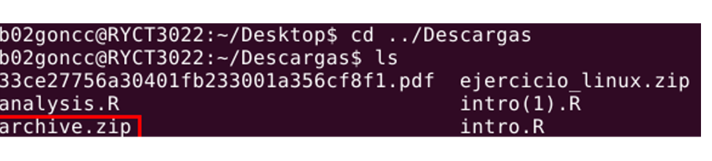
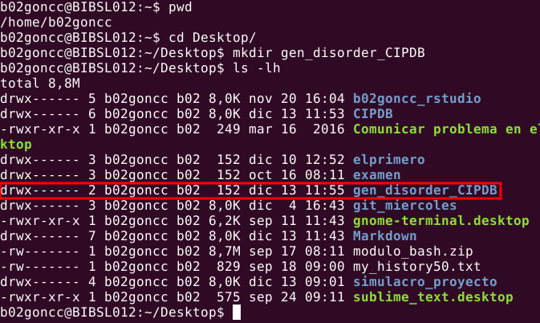
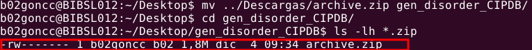
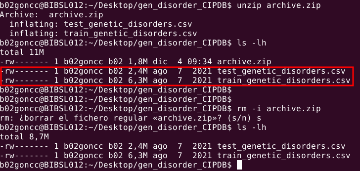
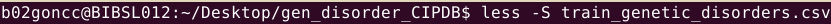
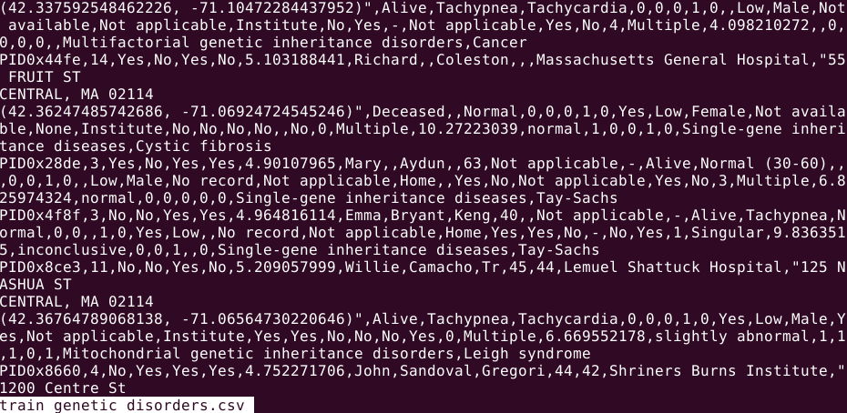

<body background = "images/fotofondo2.png">
<font color="black">

```{r setup, include=FALSE}
knitr::opts_chunk$set(echo = TRUE)
```

# Introducción y objetivos  

La predicción de **enfermedades heredables** de padres a hijos cada vez ha ido ganando un mayor peso en la  
sociedad actual. Son numerosos los **estudios genómicos** que se hacen en la actualidad con el fin de, no solo  
conocer mejor nuestro genoma, sino también el conocer las posibles enfermedades que nuestros hijos  
podrían desarrollar.

A pesar de todo, esto sigue sin ser suficiente para ayudar, ya que la población, cada vez mayor, también desa-  
rrolla una mayor cantidad de trastornos genéticos.

Nosotros vamos a trabajar con tablas de datos que muestran análisis de más de 20000 menores con  
trastornos genéticos.

Para ello, vamos a plantear una serie de hipótesis (H0):  

+ Primera hipótesis:  
 -**H0:** Las enfermedades suelen ser provocadas por un mismo tipo de trastorno genético.  
 -**H1:** Las enfermedades no suelen ser provocadas por un mismo tipo de trastorno genético.  

+ Segunda hipótesis:  
-**H0:** Las madres con mayor edad tienen hijos con mayor número de defectos en el nacimiento.  
-**H1:**Las madres con mayor edad no tienen por qué tener hijos con mayor número de defectos en el nacimiento.

+ Tercera hipótesis:  
-**H0:**  
-**H1:**


# Materiales y métodos 
El análisis se ha realizado a partir de las tablas de datos descargadas desde el repostorio de Amit Kumar  
(*Predict the genetic disorders dataset-of genomes*) en kaggle.  
Primero visualizaremos los archivos usando el terminal, para después realizar el tratamiento de datos y la  
resolución de nuestras hipótesis mediante **R** [@R-base], y lo redactaremos como un informe utilizando  
RMarkdown, para lo que haremos uso de los paquetes:  

**dplyr** [@R-dplyr]  
**ggplot2** [@R-ggplot2; @ggplot22016]  
**knitr** [@R-knitr; @knitr2014; @knitr2015]
**kableExtra** [@R-kableExtra]

Por último, subiremos todos los archivos de nuestro proyecto a un [repostorio público](https://github.com/cargoncam02/predict_genome_disorders.git) en GitHub, para libre  
acceso al código y sus contenidos.

## Trabajo en el terminal {.tabset .tabset-pills}

Para ello, vamos a empezar descargando los archivos desde el repositorio de Amit Kumar en [kaggle](https://www.kaggle.com/datasets/aibuzz/predict-the-genetic-disorders-datasetof-genomes/data).

Posteriormente, se extraerán y reubicarán los archivos desde el terminal, con
la siguiente secuencia:

### Localizamos los archivos
Nos quedamos con el nombre del documento descargado, archive.zip, y la ruta de la carpeta en la que  
se ha descargado, y la buscamos en el terminal.

{width="80%"}


### Creación de un nuevo directorio
Ahora, vamos a crear un nuevo directorio, llamado *gen_disorder_CIPDB*, en el escritorio, en el que guarda-  
remos todo lo referente a nuestro proyecto:



### Muda de archivos al nuevo directorio
Ahora movemos el archivo *archive.zip* de la carpeta *Descargas* a la nueva carpeta de nuestro escritorio:  

{width="80%"}

### Descomprimir archivos
Como *archive.zip* es un archivo comprimido, lo descomprimimos con el comando unzip. Una vez descom-  
primidos los archivos, podemos eliminar el zip:  

{width="80%"}  

### Visualización de archivos

Las dos tablas de datos son muy similares, solo que una se utilizó para entrenar al programa  
en la predicción de enfermedades en función de los síntomas, y la otra simplemente es  
una recogida de datos reales.  

{width="80%"}  

{width="80%"}  

Al visualizar los datos desde el terminal, y ver la dificultad que supondría seguir con el análisis   
de los datos desde ahí, se decidió utilizar R para realizar el análisis de datos.  

## Tratamiento de datos en R {.tabset .tabset-pills}  

Una vez colocados todos los archivos descargados, se crea un nuevo proyecto a partir de la carpeta  
*gen_disorder_CIPDB*, y se crea un nuevo archivo RMarkdown. Se van a tratar
los datos a partir de  
bloques de código insertados en el informe.  
Lo primero va a ser cargar los paquetes con los que se va a trabajar:


```{r, carga_dependencias, echo=TRUE, warning=FALSE, message=FALSE}
#Aquí se podrán instalar los paquetes en caso de no tenerlos (solo habría que
#quitarles el hashtag al principio de la línea):

#install.packages("dplyr")
#install.packages("ggplot2")
#install.packages("kableExtra")

#Ahora, se cargan los paquetes:
library(dplyr)
library(ggplot2)
library(kableExtra)

#Vamos a cargar también el data_frame:
dataset <- read.csv("train_genetic_disorders.csv", row.names = NULL)
```


```{r modif_dataset, echo=FALSE}
#Aqui vamos a modificar nuestro dataset para poder trabajar con él
mod_data <- dataset %>% 
  select(2:7,11,12,15:17,24:27,29:38,44,45)

```

Por último: se va a representar una gráfica con todas las variables que
vamos a utilizar, pero vamos a  
necesitar hacerlo en varias tablas para poder visualizar todas las columnas decentemente:

El bloque de código para cada una sería similar a esto:
```{r tablaejemplo, eval=FALSE}
knitr::kable(head(mod_data %>% 
                    select(15:21)), align="c", format="html") %>% 
  kable_styling(bootstrap_options =c("bordered", "responsive", "hover"), full_width = F, font_size = 12)

```

### Primera parte

```{r tabla1, echo=FALSE}
knitr::kable(head(mod_data %>% 
                    select(1:7)), align="c", format="html", col.names = c("Edad (Niño)", "Defectos génicos (Madre)", "Defectos génicos (Padre)", "Defecto materno", "Defecto paterno", "Glóbulos rojos (mcL)", "Edad (Madre)")) %>% 
  kable_styling(bootstrap_options =c("bordered", "responsive", "hover"), full_width = F, font_size = 12, )

```

### Segunda parte  

```{r tabla2, echo=FALSE}
knitr::kable(head(mod_data %>% 
                    select(8:14)), align="c", format="html") %>% 
  kable_styling(bootstrap_options =c("bordered", "responsive", "hover"), full_width = F, font_size = 12)

```

### Tercera parte  

```{r tabla3, echo=FALSE}
knitr::kable(head(mod_data %>% 
                    select(15:21)), align="c", format="html") %>% 
  kable_styling(bootstrap_options =c("bordered", "responsive", "hover"), full_width = F, font_size = 12)

```

### Cuarta parte  

```{r tabla4, echo=FALSE}
knitr::kable(head(mod_data %>% 
                    select(22:27)), align="c", format="html") %>% 
  kable_styling(bootstrap_options =c("bordered", "responsive", "hover"), full_width = F, font_size = 12)

```

## Elaboración de gráficas con ggplot2{.tabset .tabset-pills}
### Primera hipótesis
Para demostrar la primera hipótesis, vamos a crear una gráfica con *geom_bar()* que nos muestre la  
cantidad de afectados por cada tipo de enfermedad, y vamos colorear las barras en función de  
los desórdenes genéticos que las provocan:

```{r disease, echo=TRUE, message=FALSE, warning=FALSE}
mod_data %>% 
  filter(Disorder.Subclass != "" ,
         Genetic.Disorder != "") %>% 
  mutate(Disorder.Subclass = as.factor(ifelse(Disorder.Subclass == "Alzheimer's", "Alz", ifelse(Disorder.Subclass == "Cystic fibrosis","F.Quis", ifelse(Disorder.Subclass == "Leber's hereditary optic neuropathy", "LHON", ifelse(Disorder.Subclass == "Hemochromatosis", "HChr", ifelse(Disorder.Subclass == "Cancer", "Canc", ifelse(Disorder.Subclass == "Diabetes", "Diab", ifelse(Disorder.Subclass == "Leigh syndrome", "LS", ifelse(Disorder.Subclass == "Mitochondrial myopathy", "MM", ifelse(Disorder.Subclass == "Tay-Sachs", "TS", Disorder.Subclass)))))))))),
         Genetic.Disorder = as.factor(ifelse(Genetic.Disorder == "Mitochondrial genetic inheritance disorders", "Trastornos de la herencia genética mitocondrial", ifelse(Genetic.Disorder == "Multifactorial genetic inheritance disorders", "Trastornos de herencia genética multifactorial", "Enfermedades de herencia monogénica")))) %>% 
  ggplot(aes(x = Disorder.Subclass, fill = Genetic.Disorder)) +
  geom_bar() +
  ggtitle("Distribución de tipos de enfermedad en función del desorden genético") +
  labs(x="Tipo de enfermedad", y="Nº de incidencias", caption = "No se han tenido en cuenta los valores nulos de las variables.
       Alz: Alzheimer, Canc: Cáncer, Diab: Diabetes, F.Quis: Fibrosis
       Quística, HChr: Hemocromatosis, LHON: Neuropatía óptica heredi-
       taria de Leber, LS: Síndrome de Leigh, MM: Miopatía Mitocondrial,
       TS: Enfermedad de Tay-Sachs.", fill="Tipos de desorden genético:") +
  theme(legend.position= "right", axis.line = element_line(linewidth = 1, colour = "red"))
```

### Segunda hipótesis
```{r cuant-cual, echo=TRUE, message=FALSE, warning=FALSE}

```
### Tercera hipótesis

## Elaboración del informe con R Markdown  
Para elaborar el informe se ha introducido un encabezado en formato YAML, para poner el título,  
el nombre de los autores, la fecha y el tipo de salida.  

# Resultados y conclusiones


# Bibliografía  

Manipulación de tablas en RMarkdown:  
[http://destio.us.es/calvo/Qficheros/ComoCrearTablasRMarkdown_PedroLuque_2019Sep_librodigital.pdf](http://destio.us.es/calvo/Qficheros/ComoCrearTablasRMarkdown_PedroLuque_2019Sep_librodigital.pdf)
Fondo página HTML:  
[https://desarrolloweb.com/articulos/1384.php](https://desarrolloweb.com/articulos/1384.php)  
Manual de uso de expresiones lógicas:
[https://rsanchezs.gitbooks.io/rprogramming/content/chapter9/filter.html](https://rsanchezs.gitbooks.io/rprogramming/content/chapter9/filter.html)  
Para aprender a hacer tablas más complejas:  
[https://rpubs.com/JeisonAlarcon/Tables-R](https://rpubs.com/JeisonAlarcon/Tables-R)

</font>
</body>
